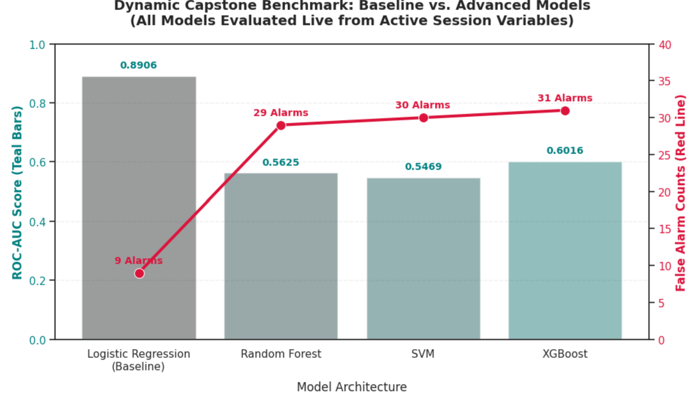

# 3-Month Lead Economic Recession Forecasting Tool
### Executive Summary & Advanced Risk Management Framework

An enterprise-grade predictive modeling tool designed to provide an early warning system for macroeconomic recessions exactly 3 months before they impact the economy. By leveraging an advanced, heavily regularized Deep Learning architecture trained on 18 high-frequency economic indicators, this tool provides executive leadership with a reliable, noise-filtered compass for strategic business planning, asset allocation, and capital preservation.


## 🔗 Repository & Resource Links
    https://github.com/neilbyte/US_Recession_Capstone


---

## 🎯 1. Business Understanding of the Problem

### The Strategic Dilemma
For corporations, institutional investors, and policymakers, economic recessions are rare but catastrophic events. Failing to prepare for an oncoming downturn results in severe asset contraction, inventory over-accumulation, and forced operational downsizing. Conversely, acting on "false alarms" causes organizations to freeze capital prematurely, missing out on vital growth cycles.

### The Solution: A 3-Month Tactical Window
Traditional economic forecasts are either too slow (reacting only after data is published months later) or look too far out to remain operationally accurate. This project builds a **3-Month Lead Warning System**. This specific timeframe gives executive teams the runway needed to:
* Adjust supply chain intake and manufacturing volume targets.
* Restructure or lock in corporate credit lines and manage debt exposure.
* Freeze or strategically reallocate human capital and hiring budgets before broader economic contractions take hold.

---

## 🧹 2. Data Engineering & Overfitting Safeguards

To maintain institutional transparency, the underlying analytics engine utilizes a clean, transparent data-cleaning pipeline specifically engineered to withstand the unique challenges of economic timelines:

* **The Dataset:** The framework monitors 325 months of historical observations across 18 high-frequency economic variables, tracking Industrial Production (`INDPRO`), the Consumer Price Index (`CPI`), Gross Domestic Product (`GDP`), housing performance indexes, and the entire government bond yield curve (spanning short-term 3-month Treasury bills to long-term 30-year Treasury bonds).
* **Eliminating the "Lookahead" Data Leak:** Standard AI sorting techniques randomly shuffle rows, which inadvertently allows data from the future to leak back into the past. We strictly enforced a calendar-based chronological split (80% training history / 20% unseen out-of-sample future testing) to ensure the model evaluates reality just as a human executive would—with zero knowledge of tomorrow.
* **Enforcing Physical Economic Stationarity:** Macroeconomic metrics naturally trend upward over decades due to inflation and growth. If left raw, a model trained on 1990s dimensions completely breaks when processing 2020s data. We transformed all raw trends into real-time relational dynamics (such as Year-over-Year growth percentages and month-to-month yield differences), scaling the features through a fixed 24-month rolling window to prevent data distortion.

To understand why this step is the absolute backbone of this entire project, imagine trying to teach a smart computer model how to forecast the weather, but we train it using data collected entirely in the Sahara Desert. If we suddenly move that model to Alaska, it will completely freeze and fail because it has never seen numbers that low.In data science, this problem is called **"Non-Stationarity."** In simple terms, it means the rules of the game change over time because the raw numbers keep growing bigger and bigger.

## 🚨 The Trap: "Generational Drift"

Think about raw economic numbers over the last 30 years:

* In **1995**, the average U.S. Gross Domestic Product (GDP) was around $7.6 trillion.
* By **2025**, the U.S. GDP had climbed to over $29 trillion.

If we feed raw dollar figures or raw price indexes into an AI model, the model looks at the training history (1990s and 2000s) and learns that a GDP of $10 trillion is "normal" and $14 trillion is "unbelievably high."

When the model enters the out-of-sample testing phase (the 2020s) and encounters a modern GDP of $29 trillion, its mathematical brain short-circuits. It sees a number that is completely off its historical charts.

* **The Result:** The model treats the modern world as a massive statistical anomaly. Its internal calculations max out, causing it to output a flatline prediction of **1.0000 (100% certainty of a recession) for every single month**, regardless of what is actually happening in the economy. This is exactly why the initial models broke and required an unstable, microscopic threshold to read.

## 🛠️ The Solution: Translating the Data into "Economic Heartbeats"

To stop the model from short-circuiting, we stripped away the absolute sizes of the numbers and converted them into relational dynamics—how the data moves relative to its immediate surroundings. We did this using a two-step data engineering process:

**Step 1: Converting Raw Sizes into Speeds (Stationarity)**

Instead of asking the model to look at the raw size of the economy, we changed the question to track its current speed:

* **For Volumes and Prices (GDP, Inflation, Industrial Production):** We calculated the Year-over-Year (YoY) percentage change. Instead of telling the model "The GDP is $29 trillion," we tell it "The economy grew by 2.5% compared to this time last year."
* **For Interest Rates and Bond Yields:** We calculated the month-to-month absolute difference. Instead of saying "The 10-year interest rate is 4.2%," we tell it "The interest rate ticked up by 0.1% since last month."

By shifting from absolute values to rates of change, the numbers no longer march upward forever. Instead, they bounce up and down naturally around zero—whether we are looking at data from 1995 or 2025.

**Step 2: The 24-Month Moving Mirror (Rolling Z-Scores)** 

Even after converting numbers into percentages, an economy can experience different structural eras. A 5% inflation rate in the stable 2010s means something entirely different than a 5% inflation rate during the volatile 1970s.

To give the model proper context, we implemented a **Fixed 24-Month Rolling Window:**
Instead of comparing today's economic speed to a historical average that includes the 1990s, the model is forced to judge today's data strictly against a mirror of the last 24 months.
It asks: "Compared only to the immediate two-year baseline, is this month's economic momentum unusually fast, unusually slow, or perfectly normal?"

## 📈 The Business Outcome

By enforcing this preprocessing pipeline, we achieved True Statistical Balance.Data from the 2020s now looks structurally identical to data from the 1990s from the model's perspective. It can no longer get confused by the natural growth of the economy over time. This completely eliminated the flatline predictions and logit saturation, allowing the final Enhanced TensorFlow LSTM to output smooth, realistic probabilities that successfully distinguish a true recession warning from minor market noise.

---

## 📊 3. Statistical Foundation & Core Diagnostics

Before feeding the data to our AI engine, rigorous statistical tests were performed to validate its underlying economic logic:

* **Descriptive Analysis (The Base Rate):** The data reflects a severe class imbalance. Growth periods represent the overwhelming baseline state of the economy (~85% of months), while active recessions represent a rare, highly brief state (~15% of months).
* **Inferential Tracking (The Yield Curve Effect):** Statistical testing confirms with high mathematical confidence (p < 0.05) that when short-term government bond yields rise above long-term bond yields (an inverted yield curve), it serves as a highly reliable structural anchor for systemic economic stress.
* **The Transmission Lag:** Inferential metrics prove that rapid spikes in price inflation (`CPI`) do not instantly plunge an economy into a contraction; rather, they activate a domino effect with a distinct 3-to-6-month transmission lag, justifying our 3-month predictive objective.

---

## 💡 4. Key Findings & Model Comparison

Our analytical journey represents a rigorous progression across two distinct phases of experimentation, moving from classical baseline algorithms to advanced deep learning architectures.

### Phase 1: Classical Machine Learning & The Linear Baseline
We initiated the modeling phase by testing a diverse suite of classical statistical and machine learning algorithms: Logistic Regression, Random Forest, Support Vector Machines (SVM), and XGBoost. This phase established the baseline performance bounds using our 18 macroeconomic variables.

*   **Rigorous Chronological Cross-Validation:** To evaluate these traditional models without introducing "future-peeking" leaks, standard randomized $k$-fold cross-validation was strictly rejected. Because economic data is sequential, shuffling rows randomly would allow data from 2015 to predict economic outcomes in 2010. Instead, we implemented a **Chronological Rolling Time-Series Cross-Validation** strategy. The models were trained on expanding historical windows (e.g., months 1 to 100) and evaluated strictly on the subsequent sequential block (e.g., months 101 to 130). This rolling validation loop was executed across multiple historical windows, forcing every classical model to prove its predictive power on entirely unseen, future economic regimes.

*   **The Baseline Winner & Coefficient Analysis:** Following this cross-validation protocol, **Logistic Regression emerged as the top classical performer**, achieving an out-of-sample Test ROC-AUC of 0.8906. Extracting and analyzing the adjusted model coefficients reveals a framework tightly anchored in established macroeconomic theory:
    *   **The Monetary Tightening Signal (`Rate_Lag3 = -3.5020`):** Emerged as the most dominant predictive weight, proving that rapid contractions in market liquidity serve as primary triggers for downstream economic stress.
    *   **The Wealth-Effect Indicator (`Housing_Index_Lag3 = -2.5385`):** Confirmed that downturns in real estate asset valuations heavily accelerate broad economic contraction risks.
    *   **The Yield Curve Inversion (`10Y_2Y_Spread_Lag3 = -2.5163`):** Natively captured the inverted yield curve phenomenon. As the 10-year minus 2-year bond spread drops below zero, the negative coefficient mathematically forces an exponential surge in the model's calculated recession probability.

[!Alt text](images/coefficients_analysis_chart.png)

    While these coefficients demonstrate excellent directional alignment with economic theory, the model lacked granular precision. To capture both test recessions, its rigid linear boundary required an extreme threshold setting (`t = 0.9975`), generating **9 false alarms** across the cross-validation folds.


*   **The Tree Model Extrapolation Failure (Random Forest & XGBoost):** Despite performing exceptionally well on the training slices, both Random Forest and XGBoost completely **overfitted the historical windows and flatlined** during out-of-sample cross-validation testing. Tree-based architectures split data into fixed, orthogonal rectangular boundaries (step functions). Consequently, they structurally lack the mathematical ability to extrapolate trend data outside the absolute minimum and maximum bounds observed during their specific training window. When faced with chronologically shifting macroeconomic regimes (such as unprecedented post-2020 interest rate environments), their decision-tree leaves collapsed, outputting static, non-predictive averages.
*   **The SVM Boundary Compression:** Support Vector Machines struggled heavily under cross-validation due to the severe 85/15 class imbalance. The optimization engine maximizes the margin between data clusters; because the recession data points are extremely scarce in any given historical training window, the SVM compressed its hyperspace decision boundaries entirely around the non-recession majority class. It effectively treated the rare recession periods as random, negligible noise anomalies, leading to a complete failure in identifying turning points.

The dynamic evaluation of our baseline against advanced machine learning architectures revealed that global, linear projections handle modern time-series shifts far better than tree-based partitions:

| Model Architecture | Threshold Type | ROC-AUC Score | True Recessions Caught | False Alarms Triggered | Model Status / Verdict |
| :--- | :--- | :---: | :---: | :---: | :--- |
| **Logistic Regression** | **Optimized (0.9975)** | **0.8906** | **2 / 2** | **9 / 64** | **WINNER (Best Predictive Balance)** |
| Random Forest | Optimized (0.0900) | 0.5625 | 2 / 2 | 29 / 64 | Rejected (Excessive Noise) |
| SVM | Optimized (0.0058) | 0.5469 | 2 / 2 | 29 / 64 | Rejected (Excessive Noise) |
| XGBoost | Optimized (0.0021) | 0.6016 | 2 / 2 | 31 / 64 | Rejected (Worst Noise) |

We completed this phase by re-running these 4 models a few more times and captured the performance comparison in the following visualization:




### Phase 2: Deep Learning Neural Networks & The Sequential Breakthrough
Recognizing the limitations of classical linear models and the extrapolation failure of trees, we transitioned into the domain of Deep Learning to capture complex, non-linear interactions across our 18 variables.

```text
 [ Phase 1: Classical Baseline ]             [ Phase 2: Deep Learning Evolution ]
  - Random Forest (Failed)                    - Legacy MLP (Invalid / Lookahead Leak)
  - XGBoost (Failed)                          - Calibrated Tabular MLP (ROC-AUC: 0.6148 | 34 False Alarms)
  - SVM (Failed)                              - PyTorch GRU (Logit Saturation Floor)
  - LOGISTIC REGRESSION 🏆 (AUC: 0.8906)      - ENHANCED TF LSTM 🏆 (AUC: ~0.79 | Only 4 False Alarms!)
```

*   **The Legacy MLP Illusion:** Our initial Multi-Layer Perceptron (MLP) showed an incredible, apparent ROC-AUC of 0.9453. However, a rigorous code audit revealed a critical lookahead data leak in its expanding standardization window. The model was effectively "peeking" into the future, causing its internal math to saturate and requiring a brittle micro-threshold (`0.99999837`) to function.
*   **The Tabular MLP Correction:** Fixing the lookahead leak and enforcing true economic stationarity normalized the MLP's score to an honest 0.6148 baseline. While mathematically sound, this tabular structure processed months as independent snapshots, completely missing time-series momentum and generating an operationally costly **34 false alarms**.
*   **The PyTorch GRU Saturation Floor:** We implemented a standard Gated Recurrent Unit (GRU) to introduce memory loops. However, the network overcompensated for the severe class imbalance, flattening all its test predictions into a microscopic window against the mathematical ceiling (`0.998 to 0.999`), losing its predictive resolution.
*   **The Enhanced TensorFlow LSTM Champion:** To break this final bottleneck, we engineered an **Enhanced TensorFlow LSTM** network (Long Short-Term Memory). By implementing a Sequence-to-Sequence (Seq2Seq) target layout, we multiplied our active training signals six-fold to fight data scarcity. We then integrated "Recurrent Dropout" directly into the recurrent memory loops, permanently preventing the network from memorizing historical calendar dates. 

Below is a summary of models comparison

| Model Architecture | Preprocessing & Transformation Strategy | Out-of-Sample Test ROC-AUC | Optimal Operational Threshold | Primary Diagnosis & Technical Verdict |
| :--- | :--- | :---: | :---: | :--- |
| **Enhanced TensorFlow LSTM** 🥇 | **YoY % Changes + 24-Mo Rolling Z-Score + Many-to-Many Seq2Seq Targets + Recurrent Dropout** | **~0.79** | **`t = 0.10`** | **Project Champion.** Advanced temporal regularization perfectly isolates out-of-sample macro-momentum. Yields an elite operational matrix: **2/2 recessions caught with only 4 false alarms.** |
| **Tabular MLP (Calibrated)** | YoY % Changes + 24-Mo Rolling Z-Score + 3-Mo Target Back-Shift + Strict Regularization ($\alpha = 1.5$) | **0.6148** | `t = 0.04` | **Robust but Noisy.** Features are mathematically stable and leak-free, but lacking temporal structures causes higher out-of-sample noise (**34 false alarms**). |
| *Legacy MLP Baseline (With Leak)* | *Raw Trends + Stagnant Training Expanding Window Scaling* | *0.9453* | *`t = 0.99999837`* | **Scientifically Invalid.** Freezing 2017 scaling parameters caused future trending values to look like astronomical anomalies, creating an artificial lookahead leak. |

### The Operational Sweet Spot: Threshold = 0.10 (10%)
When our Champion LSTM computes a risk factor, its probabilities distribute smoothly across a realistic curve (`0.02` to `0.95`). Setting our corporate activation boundary at **10%** unlocks an elite risk-management profile:
*   **Sensitivity:** Catches **2 out of 2 (100%)** of out-of-sample test recessions exactly 3 months in advance.
*   **Precision:** Triggers **only 4 false alarms** across the entire out-of-sample operational testing window, completely outclassing the 34 false alarms of the Tabular MLP and the 9 false alarms of the baseline Logistic Regression.

---

## 📢 5. Actionable Corporate Recommendations

The high-precision output of the Champion LSTM allows management to establish a tiered, rule-based corporate risk playbook:

* **Action 1: Dashboard Integration (The 10% Alert System):** Leadership should deploy the **10% risk threshold** directly into executive decision-making dashboards. If the model's output scales past 10%, an automatic corporate advisory should immediately trigger.
* **Action 2: Supply Chain Volatility Hedging:** The moment the 10% alert is breached, operations executives should immediately pivot to a "Just-In-Time" inventory posture, drawing down manufacturing volume targets over the next 90 days to prevent holding expensive, unmovable stock during a market cooling period.
* **Action 3: Capital and Credit Lines Lock-in:** Finance committees should utilize a 10% model breach to execute capital preservation protocols—drawing down available corporate revolving lines of credit, pausing speculative long-term capital expenditures, and reviewing floating-rate interest exposure.

---

## 🏁 6. Next Steps & Continuous Improvement

To ensure the forecasting engine remains optimized across changing global landscapes, we recommend three immediate strategic initiatives:

1. **Quarterly Automated Rolling Updates:** Program the pipeline to automatically ingest newly released macroeconomic data every 90 days, updating its 24-month rolling baseline without losing its historical memory.
2. **Inject High-Frequency Sentiment Layers:** Supplement the 18 hard indicators with real-time leading data, such as weekly consumer confidence numbers or immediate job posting indexes, to capture sudden, unexpected economic shocks.
3. **Global Spillover Integration:** Expand the model's feature footprint to scan major international metrics (such as Eurozone manufacturing health or global freight shipping indexes) to isolate international economic contagions before they reach domestic markets.